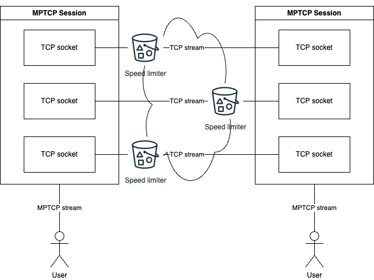

# Multi-path TCP



## How to transfer a file

1. Install Rust: <https://www.rust-lang.org/tools/install>
1. `git clone <REPO_URL>.git`
1. On the server side, run `cargo run -r -p cli --bin server -- <STREAMS> <LISTEN> <COMMAND>`
   - `<LISTEN>`: The listen address
     - e.g., `tcp://127.0.0.1:12345`
     - e.g., `mptcp.4://127.0.0.1:12345`
       - `.4`: The maximum number of TCP streams to accept
   - `<COMMAND>`: either:
     - `push <SOURCE_FILE>`: To push a file from `<SOURCE_FILE>` to the peer
     - `pull <OUTPUT_FILE>`: To pull a file from the peer to `<OUTPUT_FILE>`
1. On the client side, run `cargo run -r -p cli --bin client -- <STREAMS> <SERVER> <COMMAND>`
   - `<SERVER>`: The server address
     - e.g., `tcp://127.0.0.1:12345`
     - e.g., `mptcp.4://127.0.0.1:12345`
       - `.4`: The number of TCP streams to connect

## How to use MPTCP in code

Server:

```rust
let mut listener = MptcpListener::bind(addr, max_session_streams).await.unwrap();
let stream = listener.accept().await.unwrap();
let (mut read, mut write) = stream.into_split();
let mut buf = [0; 13];
read.read_exact(&mut buf).await.unwrap();
write.write_all(b"Hello client!").await.unwrap();
```

Client:

```rust
let stream = MptcpStream::connect(addr, num_streams).await.unwrap();
let (mut read, mut write) = stream.into_split();
write.write_all(b"Hello server!").await.unwrap();
let mut buf = [0; 13];
read.read_exact(&mut buf).await.unwrap();
```
